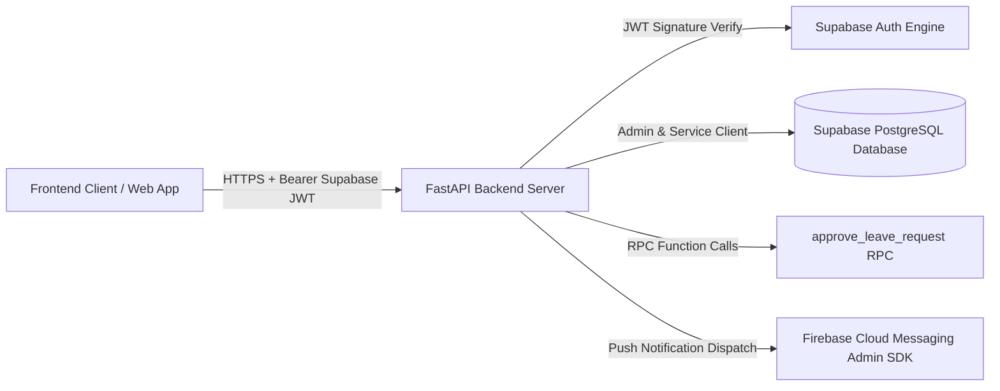
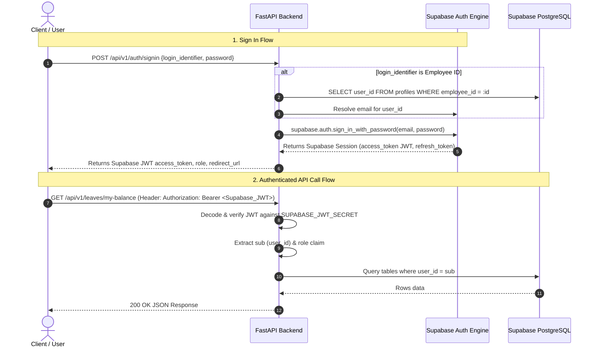
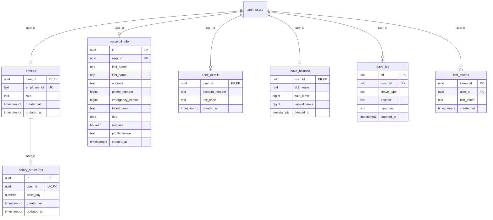

# Dayflow HRMS — Comprehensive Backend Implementation Plan

A comprehensive engineering plan detailing all backend endpoints, data flows, Supabase Auth JWT lifecycle, database schemas matching **[`docs/schema.md`](file:///C:/odoo-nmit-hackathon/docs/schema.md)**, business logic algorithms, SQL RPC functions, and error handling.

---

## 1. Architectural Principles & Technology Stack



### Core Technologies
- **Framework**: Python 3.11+ / FastAPI
- **Authentication**: Native **Supabase Auth & Supabase-issued JWTs** (HS256 verification using `SUPABASE_JWT_SECRET`)
- **Database**: PostgreSQL on Supabase (`profiles`, `personal_info`, `bank_details`, `salary_structures`, `leave_balance`, `leave_log`, `fcm_tokens`)
- **RPC Logic**: PostgreSQL Stored Procedure (`approve_leave_request`)
- **Notifications**: Firebase Cloud Messaging (`firebase-admin`)

---

## 2. Supabase Auth & JWT Lifecycle Specification



### JWT Validation Standard (`app/core/auth.py`)
- Every incoming request to protected routes passes through `Depends(get_current_user)`.
- Token parsed from `Authorization: Bearer <token>`.
- Signature verified against `SUPABASE_JWT_SECRET` using algorithm `HS256`.
- Extracts:
  - `sub`: Supabase Auth UUID (`user_id`).
  - `email`: User registered email.
  - `user_metadata.role`: Role string (`employee` or `admin`).
  - `user_metadata.employee_id`: Login code.
- Admin routes use `Depends(require_role("admin"))` which rejects non-admin users with a `403 Forbidden`.

---

## 3. Database Schema Compliance (`docs/schema.md`)



---

## 4. Module Specifications & Endpoints Blueprint

---

### 4.1 Authentication & User Access (`/api/v1/auth`)

#### 1. `POST /api/v1/auth/signup`
- **Purpose**: Initial company & admin signup.
- **Request Body**:
  ```json
  {
    "company_name": "Odoo India",
    "first_name": "John",
    "last_name": "Doe",
    "email": "john.doe@odoo.com",
    "phone_number": 9876543210,
    "password": "Password123!",
    "confirm_password": "Password123!",
    "role": "admin"
  }
  ```
- **Login ID Auto-generation Algorithm**:
  $$\text{Login ID} = \text{Initials}(\text{company\_name}) + \text{first\_name}[:2].\text{upper}() + \text{last\_name}[:2].\text{upper}() + \text{YYYY} + \text{Serial}(4\text{ digits})$$
  *(e.g., "Odoo India" + "John" + "Doe" + 2026 + 1 $\rightarrow$ `OIJODO20260001`)*
- **Database Operations**:
  1. Call Supabase Auth `sign_up()` with metadata (`role`, `employee_id`, `first_name`, `last_name`).
  2. Insert into `public.profiles`: `(user_id, employee_id, role)`.
  3. Insert into `public.personal_info`: `(user_id, first_name, last_name, phone_number, address)`.
  4. Insert into `public.leave_balance`: `(user_id, sick_leave=12.0, paid_leave=0, unpaid_leave=0)`.
  5. Insert into `public.salary_structures`: `(user_id, base_pay=50000.00)`.
- **Response (201 Created)**:
  ```json
  {
    "success": true,
    "message": "Registration successful. Please verify your email.",
    "user_id": "8a32b2a6-1912-4217-9154-1b7da7d94fbc",
    "employee_id": "OIJODO20260001",
    "email": "john.doe@odoo.com",
    "role": "admin",
    "email_confirmed": false
  }
  ```

#### 2. `POST /api/v1/auth/signin`
- **Purpose**: Authenticate user via Email OR Login ID.
- **Request Body**:
  ```json
  {
    "login_identifier": "OIJODO20260001", // Or "john.doe@odoo.com"
    "password": "Password123!"
  }
  ```
- **Execution Flow**:
  1. If `login_identifier` does not contain `@`, resolve email by querying `public.profiles` for `user_id` $\rightarrow$ get email.
  2. Call Supabase Auth `sign_in_with_password()`.
  3. Verify `email_confirmed_at` is present.
  4. Query `public.profiles` to resolve current `role` and `employee_id`.
- **Response (200 OK)**:
  ```json
  {
    "access_token": "eyJhbGciOiJIUzI1NiIs...",
    "refresh_token": "v1.mcG...",
    "token_type": "bearer",
    "expires_in": 3600,
    "user_id": "8a32b2a6-1912-4217-9154-1b7da7d94fbc",
    "email": "john.doe@odoo.com",
    "role": "admin",
    "employee_id": "OIJODO20260001",
    "redirect_url": "/employees"
  }
  ```

#### 3. `GET /api/v1/auth/me`
- **Auth**: `Bearer <Supabase_JWT>`
- **Response (200 OK)**:
  ```json
  {
    "user_id": "8a32b2a6-1912-4217-9154-1b7da7d94fbc",
    "employee_id": "OIJODO20260001",
    "role": "admin",
    "first_name": "John",
    "last_name": "Doe",
    "phone_number": 9876543210,
    "emergency_contact": null,
    "address": "123 Main St, Bangalore",
    "blood_group": "O+",
    "dob": "1995-05-15",
    "married": false,
    "profile_image": "https://supabase-storage-url/avatar.png",
    "bank_details": {
      "account_number": "123456789012",
      "ifsc_code": "SBIN0001234"
    }
  }
  ```

---

### 4.2 Employee Profiles Management (`/api/v1/employees`)

#### 1. `GET /api/v1/employees` (Directory Grid Cards)
- **Auth**: `Bearer <Supabase_JWT>`
- **Returns**: List of active employees with live status badge indicators:
  - 🟢 **Present**: Checked in today.
  - ✈️ **On Leave**: Active approved request in `leave_log` today.
  - 🟡 **Absent**: Not checked in and no approved leave.
- **Response Format**:
  ```json
  [
    {
      "user_id": "8a32b2a6-1912-4217-9154-1b7da7d94fbc",
      "employee_id": "OIJODO20260001",
      "first_name": "John",
      "last_name": "Doe",
      "role": "employee",
      "profile_image": "https://...",
      "phone_number": 9876543210,
      "work_status": "PRESENT", // "PRESENT" | "ON_LEAVE" | "ABSENT"
      "status_badge_color": "GREEN" // "GREEN" | "BLUE_PLANE" | "YELLOW"
    }
  ]
  ```

#### 2. `POST /api/v1/employees` (Admin Onboarding)
- **Auth**: `Bearer <Supabase_JWT>` + `role == 'admin'`
- **Request Body**:
  ```json
  {
    "company_name": "Odoo India",
    "first_name": "Jane",
    "last_name": "Smith",
    "email": "jane.smith@odoo.com",
    "phone_number": 9123456780,
    "dob": "1998-08-20",
    "blood_group": "B+",
    "base_pay": 60000.00
  }
  ```
- **Logic**: Generates Login ID (`OIJASM20260002`), auto-generates secure initial password, creates Supabase user, and initializes `profiles`, `personal_info`, `leave_balance`, and `salary_structures`.

#### 3. `PUT /api/v1/employees/{user_id}/personal-info`
- **Auth**: `Bearer <Supabase_JWT>` (Self or Admin)
- **Updates**: `public.personal_info` fields (`address`, `phone_number`, `emergency_contact`, `blood_group`, `dob`, `married`, `profile_image`).

#### 4. `PUT /api/v1/employees/{user_id}/bank-details`
- **Auth**: `Bearer <Supabase_JWT>` (Self or Admin)
- **Updates**: Upserts into `public.bank_details` (`account_number`, `ifsc_code`).

---

### 4.3 Systray Attendance Management (`/api/v1/attendance`)

#### 1. `POST /api/v1/attendance/check-in`
- **Auth**: `Bearer <Supabase_JWT>`
- **Action**: Registers check-in timestamp for current day. Changes user status to Checked-In (🟢 Green dot).

#### 2. `POST /api/v1/attendance/check-out`
- **Auth**: `Bearer <Supabase_JWT>`
- **Action**: Registers check-out timestamp, calculates total hours worked, regular hours (up to 8 hrs), and extra/overtime hours. Updates status dot to 🔴 Red.

#### 3. `GET /api/v1/attendance/status` (Systray Active State)
- **Auth**: `Bearer <Supabase_JWT>`
- **Response**:
  ```json
  {
    "is_checked_in": true,
    "check_in_time": "2026-08-22T09:30:00Z",
    "elapsed_seconds": 7200,
    "display_text": "Since 09:30 AM",
    "status_color": "GREEN"
  }
  ```

#### 4. `GET /api/v1/attendance/my-logs`
- **Auth**: `Bearer <Supabase_JWT>`
- **Response**: Summary counters (`days_present`, `leaves_count`, `total_working_days`) + personal daily log array.

#### 5. `GET /api/v1/attendance/all` (Admin Overview)
- **Auth**: `Bearer <Supabase_JWT>` + `role == 'admin'`
- **Query Params**: `?date=2026-08-22&search=`
- **Returns**: Organization-wide table: `Emp Name`, `Check In`, `Check Out`, `Work Hours`, `Extra Hours`.

---

### 4.4 Time-Off & Leave Management (`/api/v1/leaves`)

#### 1. `GET /api/v1/leaves/my-balance`
- **Auth**: `Bearer <Supabase_JWT>`
- **Query**: Reads `public.leave_balance` for current user.
- **Response**:
  ```json
  {
    "user_id": "8a32b2a6-1912-4217-9154-1b7da7d94fbc",
    "sick_leave": 12.0,
    "paid_leave": 24,
    "unpaid_leave": 0
  }
  ```

#### 2. `POST /api/v1/leaves/apply` (Submit Leave Application)
- **Auth**: `Bearer <Supabase_JWT>`
- **Request Body**:
  ```json
  {
    "leave_type": "sick", // "sick" | "paid" | "unpaid"
    "reason": "Viral fever recovery",
    "duration": 1.0
  }
  ```
- **Action**: Inserts row into `public.leave_log`:
  - `id`: Auto UUID
  - `user_id`: Current user ID
  - `leave_type`: `"sick"`
  - `reason`: `"Viral fever recovery"`
  - `approved`: `"Waiting for approval"`
- **Response (201 Created)**: Leave record details.

#### 3. `GET /api/v1/leaves/pending` (Admin Approval Queue)
- **Auth**: `Bearer <Supabase_JWT>` + `role == 'admin'`
- **Action**: Queries `public.leave_log` joined with `personal_info` where `approved = 'Waiting for approval'`.

#### 4. `POST /api/v1/leaves/{id}/approve` (Admin RPC Approval)
- **Auth**: `Bearer <Supabase_JWT>` + `role == 'admin'`
- **Request Body**:
  ```json
  {
    "duration": 1.0
  }
  ```
- **Backend Execution**:
  1. Invokes the Supabase SQL RPC function:
     ```python
     res = supabase.rpc("approve_leave_request", {
         "p_leave_id": str(leave_id),
         "p_duration": payload.duration
     }).execute()
     ```
  2. Queries `public.fcm_tokens` for the leave applicant and dispatches push notification:
     - Title: `"Leave Request Approved"`
     - Body: `"Your leave request for {leave_type} has been approved."`
- **Response (200 OK)**: Success message and updated balance.

#### 5. `POST /api/v1/leaves/{id}/reject` (Admin Rejection)
- **Auth**: `Bearer <Supabase_JWT>` + `role == 'admin'`
- **Request Body**: `{"remarks": "Critical team sprint milestone"}`
- **Action**: Updates `leave_log.approved = 'Rejected'`, sends FCM rejection notification.

---

### 4.5 Payroll & Salary Management (`/api/v1/payroll`)

#### 1. Salary Calculation Engine Formula (Excalidraw Exact Compliance)
Given `base_pay` from `public.salary_structures`:
- $\text{Basic Salary} = 50\% \times \text{base\_pay}$
- $\text{HRA} = 50\% \times \text{Basic Salary} = 25\% \times \text{base\_pay}$
- $\text{Standard Allowance} = \text{Fixed } ₹4,167.00$
- $\text{Performance Bonus} = 8.33\% \times \text{Basic Salary}$
- $\text{Leave Travel Allowance (LTA)} = 8.33\% \times \text{Basic Salary}$
- $\text{Fixed Allowance} = \text{base\_pay} - (\text{Basic} + \text{HRA} + \text{Standard Allowance} + \text{Bonus} + \text{LTA})$
- $\text{Provident Fund (PF)} = 12\% \times \text{Basic Salary}$
- $\text{Professional Tax (PT)} = \text{Fixed } ₹200.00$
- $\text{Gross Salary} = \text{base\_pay}$
- $\text{Total Deductions} = \text{PF} + \text{PT}$
- $\text{Net Salary} = \text{Gross Salary} - \text{Total Deductions}$

#### 2. `GET /api/v1/payroll/my-salary` (Employee Read-Only)
- **Auth**: `Bearer <Supabase_JWT>`
- **Action**: Queries `public.salary_structures` for current user and returns full computed breakdown.

#### 3. `GET /api/v1/payroll/all` & `GET /api/v1/payroll/employee/{user_id}` (Admin View)
- **Auth**: `Bearer <Supabase_JWT>` + `role == 'admin'`
- **Action**: Queries all/single employee `salary_structures` and returns breakdown.

#### 4. `PUT /api/v1/payroll/employee/{user_id}` (Admin Update Base Pay)
- **Auth**: `Bearer <Supabase_JWT>` + `role == 'admin'`
- **Request Body**: `{"base_pay": 65000.00}`
- **Action**: Updates `base_pay` in `public.salary_structures` and returns recalculated breakdown.

#### 5. `POST /api/v1/payroll/generate-payslips` (Batch Payslip Generator)
- **Auth**: `Bearer <Supabase_JWT>` + `role == 'admin'`
- **Request Body**: `{"month": 8, "year": 2026, "total_working_days": 30}`
- **Loss of Pay (LOP) Deduction**:
  $$\text{LOP Deduction} = \left(\frac{\text{base\_pay}}{\text{total\_working\_days}}\right) \times \text{Unpaid Leave Count from } \texttt{public.leave\_log}$$
- **Output**: Array of finalized payslips with component breakdowns, deductions, and net pay.

---

### 4.6 Push Notifications (`/api/v1/notifications`)

1. **`POST /api/v1/notifications/register-token`**
   - **Request**: `{"user_id": "uuid", "fcm_token": "token_string"}`
   - **Action**: Upserts into `public.fcm_tokens`.

2. **`POST /api/v1/notifications/send`**
   - **Auth**: `Bearer <Supabase_JWT>`
   - **Request**: `{"user_id": "uuid", "title": "...", "body": "...", "data": {...}}`
   - **Action**: Queries `public.fcm_tokens` by `user_id` and sends push notification via Firebase Admin SDK.

---

## 5. File Structure Blueprint

```
backend/
├── app/
│   ├── api/
│   │   ├── auth.py              # /signup, /signin, /me, /change-password
│   │   ├── employees.py         # / (list), /{id}, /onboard, /{id}/personal-info, /{id}/bank-details
│   │   ├── attendance.py        # /check-in, /check-out, /status, /my-logs, /all
│   │   ├── leaves.py            # /my-balance, /my-requests, /apply, /pending, /{id}/approve (RPC), /{id}/reject
│   │   ├── payroll.py           # /my-salary, /all, /employee/{id}, /generate-payslips
│   │   └── notifications.py     # /register-token, /send
│   ├── core/
│   │   ├── auth.py              # Supabase JWT decoder & require_role("admin") dependency
│   │   ├── config.py            # Pydantic Settings & environment variables
│   │   └── supabase.py          # Supabase Admin and Client initializers
│   ├── schemas/
│   │   ├── auth.py              # SignUpRequest, SignInRequest, AuthTokenResponse, UserProfileResponse
│   │   ├── employee.py          # EmployeeCardResponse, EmployeeDetailResponse, AdminOnboardRequest
│   │   ├── attendance.py        # AttendanceCheckInResponse, AttendanceStatusResponse, AttendanceLogResponse
│   │   ├── leave.py             # LeaveApplyRequest, LeaveBalanceResponse, LeaveLogResponse, LeaveApproveRequest
│   │   ├── payroll.py           # SalaryStructureUpdate, SalaryStructureResponse, PayslipResponse
│   │   └── notification.py      # FCMTokenRegisterRequest, SendNotificationRequest
│   ├── services/
│   │   ├── auth_service.py      # Dual signin & Login ID generator
│   │   ├── employee_service.py  # Profile aggregation & live work status resolution
│   │   ├── attendance_service.py# Clock in/out & active duration engine
│   │   ├── leave_service.py     # approve_leave_request RPC invocation & balance checks
│   │   ├── payroll_service.py   # Salary component formulas & Loss of Pay deduction logic
│   │   └── fcm_service.py       # Firebase Cloud Messaging single & multicast delivery
│   └── main.py                  # FastAPI initialization, CORS, router inclusion
├── sql/
│   ├── profiles_auth.sql
│   ├── payroll.sql
│   └── fcm_tokens.sql
└── requirements.txt
```

---

## 6. Implementation Roadmap & Execution Sequence

1. **Step 1: Auth & Login ID Engine**
   - Update `AuthService` with Login ID generation algorithm and dual-identifier signin.
   - Add `/auth/change-password` endpoint.
2. **Step 2: Employee Profiles & Directory**
   - Implement `app/api/employees.py` and `app/services/employee_service.py`.
   - Aggregate profile view and live status resolver (🟢 Present, ✈️ On Leave, 🟡 Absent).
3. **Step 3: Systray & Attendance**
   - Implement `app/api/attendance.py` and `app/services/attendance_service.py`.
   - Add `/check-in`, `/check-out`, `/status`, and `/my-logs`.
4. **Step 4: Time-Off & Leaves with SQL RPC**
   - Implement `app/api/leaves.py` and `app/services/leave_service.py`.
   - Wire `POST /leaves/{id}/approve` directly to `supabase.rpc("approve_leave_request", ...)`.
   - Trigger FCM notification on approval/rejection.
5. **Step 5: End-to-End Verification**
   - Test full flow: Signup $\rightarrow$ Login (using Login ID) $\rightarrow$ Clock In $\rightarrow$ Apply Leave $\rightarrow$ Admin RPC Approve $\rightarrow$ Check Balance $\rightarrow$ View Salary & Payslip with LOP.
