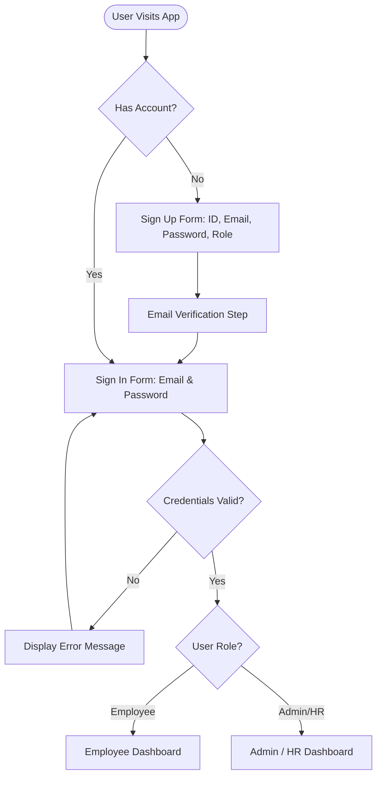
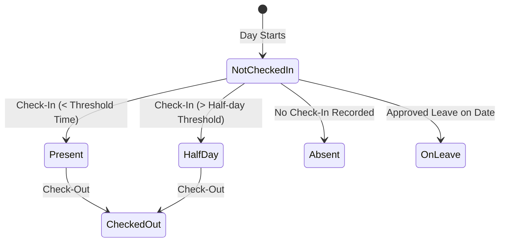
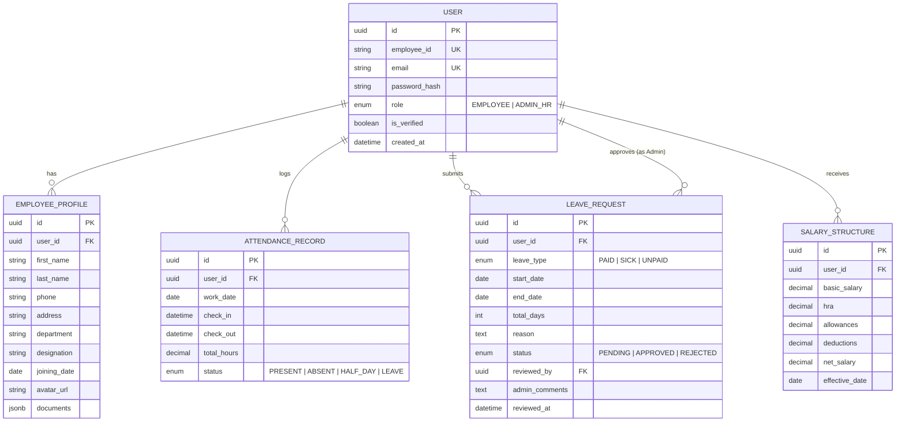

# Product Requirement Document (PRD)
# Dayflow — Human Resource Management System (HRMS)
> *"Every workday, perfectly aligned."*

---

## 1. Document Overview

| Attribute | Details |
| :--- | :--- |
| **Product Name** | Dayflow HRMS |
| **Document Version** | 1.0.0 |
| **Status** | Approved / Ready for Development |
| **Target Hackathon / Project** | Odoo NMIT Hackathon |
| **Reference Architecture** | [Excalidraw Architecture Board](https://link.excalidraw.com/l/65VNwvy7c4X/58RLEJ4oOwh) |
| **Reference Document** | [Dayflow - Human Resource Management System.pdf](file:///v:/Projects/Odoo/refrences/Dayflow%20-%20Human%20Resource%20Management%20System.pdf) |

---

## 2. Product Introduction & Objectives

### 2.1 Purpose
The purpose of **Dayflow HRMS** is to define the functional and non-functional requirements for an end-to-end Human Resource Management System. The system digitizes and streamlines core human resource workflows including employee onboarding, profile management, attendance tracking, leave requests and approvals, payroll visibility, and administrative governance.

### 2.2 Product Goals
- **Eliminate Manual Bottlenecks**: Digitize paper/spreadsheet-based attendance, leave, and profile management.
- **Role-Based Access & Security**: Deliver dedicated portals for Employees and HR Admins with strict privilege boundaries.
- **Transparency & Trust**: Give employees immediate visibility into their attendance logs, leave balances, and salary breakdown.
- **Operational Efficiency**: Provide HR administrators with batch visibility, real-time approval queues, and employee switching capabilities.

---

## 3. Scope of the System

### 3.1 In-Scope
- **Authentication & Authorization**: Secure registration, email verification, multi-role login (Admin / HR vs. Employee), session management.
- **Role-Based Dashboards**: Customized summary views, quick-action cards, and alerts.
- **Employee Profile Management**: Multi-tab profile viewer (Personal, Job, Salary, Documents), profile picture uploads, and role-governed edit permissions.
- **Attendance Management**: Check-in / Check-out clocking, status calculation (Present, Absent, Half-day, On Leave), daily and weekly attendance views.
- **Leave & Time-Off Management**: Application submission for Paid, Sick, and Unpaid leave; status tracking; multi-action HR approval workflows with comments.
- **Payroll & Salary Visibility**: Read-only breakdown for employees; administrative salary structure configuration and audit tools.

### 3.2 Out-of-Scope (Deferred to Future Enhancements)
- Automated payroll disbursement / direct bank gateway integration.
- Automated biometric hardware SDK integration (simulated via web check-in/out).
- Native mobile apps (iOS / Android) — responsive web app prioritized first.

---

## 4. User Roles & Permission Matrix

### 4.1 User Classes
1. **Admin / HR Officer**: Operational superuser responsible for employee record creation, managing attendance exceptions, approving leaves, and configuring salary structures.
2. **Employee**: Standard user with access restricted strictly to their personal profile, self attendance logging, personal leave applications, and read-only salary structure.

### 4.2 Role & Permission Matrix

| Feature / Action | Employee | Admin / HR Officer |
| :--- | :---: | :---: |
| **Sign Up / Account Creation** | Self (Pending Verification) | Self & Create on behalf |
| **View Dashboard** | Personal metrics & quick actions | Organization overview & pending queues |
| **Switch Employee Context** | ❌ No | ✅ Yes |
| **View Profile** | Self Only (Personal, Job, Salary, Docs) | All Employees |
| **Edit Profile - Basic (Phone, Address, Avatar)**| ✅ Yes | ✅ Yes |
| **Edit Profile - Core (Job Title, Dept, Salary)**| ❌ No | ✅ Yes |
| **Clock In / Clock Out** | ✅ Yes (Self) | ✅ Yes (Self & Admin Override) |
| **View Attendance Logs** | Self Only (Daily / Weekly) | Organization-wide / Per Employee |
| **Apply for Leave** | ✅ Yes (Paid, Sick, Unpaid) | ✅ Yes |
| **Approve / Reject Leave** | ❌ No | ✅ Yes (with comments) |
| **View Salary / Payroll** | ✅ Read-only (Self) | ✅ Read-only & Manage (All) |
| **Update Salary Structure** | ❌ No | ✅ Yes |

---

## 5. Functional Requirements

### 5.1 Authentication & Authorization



#### 5.1.1 Sign Up
- **Fields Required**:
  - Employee ID (Unique identifier)
  - Work Email Address
  - Password (Must meet security rules: min 8 chars, uppercase, digit, special character)
  - Role Selection (`Employee` or `HR / Admin`)
- **Validation**:
  - Check for duplicate Employee ID and Email.
  - Mandatory Email Verification workflow before unlocking access.

#### 5.1.2 Sign In & Session Management
- Login via verified Email and Password.
- Error handling with specific failure feedback (e.g., "Invalid credentials", "Account not verified").
- Automatic role detection and redirection:
  - Role `Employee` $\rightarrow$ Redirect to `/employee/dashboard`
  - Role `Admin / HR` $\rightarrow$ Redirect to `/admin/dashboard`
- Secure token/session storage and clear session termination upon Logout.

---

### 5.2 Dashboards

#### 5.2.1 Employee Dashboard
- **Quick-Access Action Cards**:
  - Profile Overview
  - Today's Attendance (Check-in / Check-out button & active timer)
  - Apply for Leave / Leave Requests History
  - Salary Breakdown link
- **Status & Alerts Feed**:
  - Recent check-in status
  - Leave approval/rejection updates
  - Upcoming holidays or company notifications

#### 5.2.2 Admin / HR Dashboard
- **Executive Metric Counters**:
  - Total Active Employees
  - Today's Present / Absent / On-Leave count
  - Pending Leave Requests count
- **Core Navigation & Tables**:
  - Directory of Employees with status tags
  - Real-time Attendance Feed
  - Pending Leave Approvals Queue
- **Employee Context Switcher**:
  - Dropdown selector enabling HR/Admins to view the system from the perspective of any specific employee record.

---

### 5.3 Employee Profile Management

#### 5.3.1 Profile Structure & View Modes
Each employee record contains:
1. **Personal Information**: Full Name, Date of Birth, Gender, Contact Email, Phone Number, Residential Address, Emergency Contact.
2. **Job Details**: Employee ID, Department, Designation / Job Title, Date of Joining, Employment Type (Full-Time, Part-Time, Contract), Reporting Manager.
3. **Salary Structure**: Base Pay, Allowances (HRA, Travel, Medical), Deductions (Tax, PF), Net Monthly Salary.
4. **Documents**: Identification proofs, contracts, certifications, uploaded PDFs/Images.
5. **Profile Picture**: Avatar display across navigation, logs, and profile header.

#### 5.3.2 Edit Permissions
- **Employee Access**: Restricted strictly to updating contact phone, residential address, emergency contact, and profile avatar.
- **Admin / HR Access**: Unrestricted editing of all employee attributes (Job title, Department, Compensation, Direct Manager, Documents).

---

### 5.4 Attendance Management



#### 5.4.1 Clocking & Tracking
- One-click **Check-In** and **Check-Out** actions with timestamp recording.
- **Daily View**: Shows clock-in time, clock-out time, total active hours, and computed status.
- **Weekly / Monthly View**: Calendar/tabular matrix showing daily statuses and weekly hour aggregations.
- **Status Categories**:
  - `Present`: Clocked in on time and completed required working hours.
  - `Absent`: No clock-in recorded for a scheduled working day.
  - `Half-day`: Worked less than standard threshold hours.
  - `Leave`: Marked when an approved leave coincides with the date.

#### 5.4.2 Access Control
- **Employee**: Can only view and log their own attendance history.
- **Admin / HR**: Can filter, inspect, and export attendance records across all employees and departments, with manual override capabilities for missed punches.

---

### 5.5 Leave & Time-Off Management

```mermaid
sequenceDiagram
    autonumber
    actor Emp as Employee
    participant Sys as Dayflow System
    actor Admin as Admin / HR Officer

    Emp->>Sys: Submit Leave Application (Type, Dates, Reason)
    Sys-->>Sys: Set Status = Pending; Notify HR
    Sys->>Admin: Display in Pending Approvals Queue
    alt Approved
        Admin->>Sys: Approve Request (Optional Comments)
        Sys-->>Sys: Set Status = Approved; Deduct Leave Balance; Update Attendance Calendar
        Sys-->>Emp: Notification & Status Update (Approved)
    else Rejected
        Admin->>Sys: Reject Request (Required Rejection Remarks)
        Sys-->>Sys: Set Status = Rejected
        Sys-->>Emp: Notification & Status Update (Rejected)
    end
```

#### 5.5.1 Leave Application (Employee)
- **Leave Types**:
  - `Paid Leave` (Annual / Vacation Leave)
  - `Sick Leave` (Medical reasons)
  - `Unpaid Leave` (Loss of pay)
- **Application Fields**:
  - Leave Type
  - Start Date & End Date (with automatic total days calculation)
  - Reason / Remarks text
  - Optional supporting attachment (e.g., medical certificate)
- **Status States**: `Pending` $\rightarrow$ `Approved` or `Rejected`

#### 5.5.2 Approval Workflow (Admin / HR)
- Unified queue of pending requests displaying employee name, department, leave type, duration, and reason.
- Actions:
  - **Approve**: Confirms leave, updates employee's leave balance, and syncs attendance calendar.
  - **Reject**: Prompts for required administrative comments explaining rejection.
- Instant reflection in employee records and live audit logs.

---

### 5.6 Payroll & Salary Management

#### 5.6.1 Employee Payroll View
- Read-only breakdown accessible via profile and salary view:
  - Gross Salary
  - Component Breakdown (Basic Salary, HRA, Special Allowance)
  - Deductions (Taxes, Provident Fund, Unpaid Leave deductions)
  - Net Pay calculation

#### 5.6.2 Admin Payroll Control
- Comprehensive directory of compensation structures for all employees.
- Ability to configure and update individual salary formulas, bonuses, and standard deductions.
- Audit safeguards to guarantee accuracy before monthly payroll finalization.

---

## 6. Non-Functional Requirements

| Dimension | Specification & Quality Attribute |
| :--- | :--- |
| **Performance** | Page loads $\le 1.5$s; API response time $\le 200$ms under normal load; instant client-side transitions. |
| **Security** | Role-Based Access Control (RBAC) enforced on backend endpoints; Bcrypt password hashing; JWT/Session authentication; CSRF & XSS protection. |
| **Reliability & Data Integrity**| ACID transactions on leave deductions and salary updates; zero data loss on attendance timestamping. |
| **UI / UX & Aesthetics** | Modern design matching Odoo ecosystem standards: clean typography, accessible color contrasts, subtle micro-interactions, responsive on desktop and tablet. |
| **Auditability** | Complete audit trails for leave approvals, profile modifications, and salary adjustments. |

---

## 7. Data Models & Entity Relationships



---

## 8. Future Enhancements (Roadmap)

1. **Email & Real-Time Push Notifications**:
   - Automated email alerts on leave submission, approvals, and monthly payslip generation.
   - In-app notification bell for immediate updates.
2. **Analytics & Reporting Dashboard**:
   - Visual charts for organization attendance trends and absenteeism rates.
   - One-click export of salary slips and monthly attendance sheets (PDF / Excel).
3. **Advanced Time-Off Policies**:
   - Accrual engines, custom holiday calendars, and comp-off workflows.
4. **Biometric & Geofencing Integrations**:
   - Mobile check-in with GPS geofencing and hardware biometric sync.

---

## 9. References & Project Assets

- **Reference Architecture Board**: [Excalidraw Diagram](https://link.excalidraw.com/l/65VNwvy7c4X/58RLEJ4oOwh)
- **Local Architecture Diagram**: [refrences/Human Resource Management System - 8 hours.excalidraw](file:///v:/Projects/Odoo/refrences/Human%20Resource%20Management%20System%20-%208%20hours.excalidraw)
- **Source Specification PDF**: [refrences/Dayflow - Human Resource Management System.pdf](file:///v:/Projects/Odoo/refrences/Dayflow%20-%20Human%20Resource%20Management%20System.pdf)
