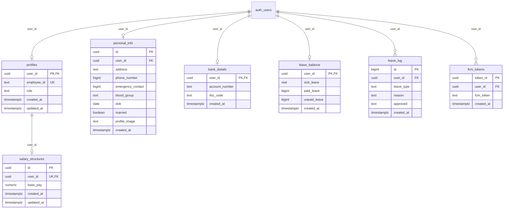

# Supabase Database Schema

*Project:* **Odoo** (`eqcknsmwlmohumvmzomb`)  
*Schema:* `public`  
*Fetched at:* 2026-08-22

---

## 1. Entity Relationship Overview

---

## 2. Table Definitions

### 2.1 `public.profiles`
Stores core identity and role mapping for authentication users.

| Column | Data Type | Constraints & Defaults | Description |
| :--- | :--- | :--- | :--- |
| `user_id` | `uuid` | `PRIMARY KEY`, `REFERENCES auth.users(id)` | User ID from Supabase Auth |
| `employee_id` | `text` | `UNIQUE`, `DEFAULT '""'` | Human-readable employee code |
| `role` | `text` | `DEFAULT '"employee"'` | System role (`employee`, `admin`, etc.) |
| `created_at` | `timestamptz` | `DEFAULT now()` | Record creation timestamp |
| `updated_at` | `timestamptz` | `DEFAULT now()` | Last update timestamp |

---

### 2.2 `public.personal_info`
Stores employee profile details and personal information.

| Column | Data Type | Constraints & Defaults | Description |
| :--- | :--- | :--- | :--- |
| `id` | `uuid` | `PRIMARY KEY`, `DEFAULT gen_random_uuid()` | Unique record ID |
| `user_id` | `uuid` | `NULLABLE`, `REFERENCES auth.users(id)` | Linked user account |
| `address` | `text` | `NULLABLE`, `DEFAULT ''` | Residential address |
| `phone_number` | `bigint` | `NULLABLE` | Primary contact number |
| `emergency_contact` | `bigint` | `NULLABLE` | Emergency phone number |
| `blood_group` | `text` | `NULLABLE` | Blood group (e.g. `O+`, `A+`) |
| `dob` | `date` | `NULLABLE` | Date of birth |
| `married` | `boolean` | `NULLABLE` | Marital status flag |
| `profile_image` | `text` | `NULLABLE` | Avatar image URL / storage path |
| `created_at` | `timestamptz` | `DEFAULT now()` | Record creation timestamp |

---

### 2.3 `public.bank_details`
Stores banking and direct deposit information.

| Column | Data Type | Constraints & Defaults | Description |
| :--- | :--- | :--- | :--- |
| `user_id` | `uuid` | `PRIMARY KEY`, `REFERENCES auth.users(id)` | Linked user account |
| `account_number` | `text` | `NULLABLE` | Bank account number |
| `ifsc_code` | `text` | `NULLABLE` | Bank IFSC / routing code |
| `created_at` | `timestamptz` | `DEFAULT now()` | Record creation timestamp |

---

### 2.4 `public.salary_structures`
Stores employee wage configuration.

| Column | Data Type | Constraints & Defaults | Description |
| :--- | :--- | :--- | :--- |
| `id` | `uuid` | `PRIMARY KEY`, `DEFAULT gen_random_uuid()` | Unique record ID |
| `user_id` | `uuid` | `UNIQUE`, `REFERENCES public.profiles(user_id)` | Linked employee profile |
| `base_pay` | `numeric` | `CHECK (base_pay >= 0)` | Monthly base wage / gross salary |
| `created_at` | `timestamptz` | `DEFAULT now()` | Record creation timestamp |
| `updated_at` | `timestamptz` | `DEFAULT now()` | Last update timestamp |

---

### 2.5 `public.leave_balance`
Tracks remaining leave balances per employee.

| Column | Data Type | Constraints & Defaults | Description |
| :--- | :--- | :--- | :--- |
| `user_id` | `uuid` | `PRIMARY KEY`, `REFERENCES auth.users(id)` | Linked user account |
| `sick_leave` | `real` | `NULLABLE`, `DEFAULT 12` | Sick leave quota |
| `paid_leave` | `bigint` | `NULLABLE` | Paid / vacation leave quota |
| `unpaid_leave` | `bigint` | `NULLABLE` | Unpaid leave quota / count |
| `created_at` | `timestamptz` | `DEFAULT now()` | Record creation timestamp |

---

### 2.6 `public.leave_log`
Tracks time-off applications, reasons, and approval workflow status.

| Column | Data Type | Constraints & Defaults | Description |
| :--- | :--- | :--- | :--- |
| `id` | `bigint` | `PRIMARY KEY`, `GENERATED BY DEFAULT AS IDENTITY` | Sequential record ID |
| `user_id` | `uuid` | `NULLABLE`, `REFERENCES auth.users(id)` | Requesting employee |
| `leave_type` | `text` | `NULLABLE` | Leave type (`sick`, `paid`, `unpaid`) |
| `reason` | `text` | `NOT NULL` | Description / reason for leave |
| `approved` | `text` | `NULLABLE`, `DEFAULT '"Waiting for approval"'` | Approval status string |
| `created_at` | `timestamptz` | `DEFAULT now()` | Request timestamp |

---

### 2.7 `public.fcm_tokens`
Stores device tokens for push notifications.

| Column | Data Type | Constraints & Defaults | Description |
| :--- | :--- | :--- | :--- |
| `token_id` | `uuid` | `PRIMARY KEY`, `DEFAULT gen_random_uuid()` | Unique token ID |
| `user_id` | `uuid` | `NULLABLE`, `REFERENCES auth.users(id)` | Target user |
| `fcm_token` | `text` | `NOT NULL` | Firebase Cloud Messaging token |
| `created_at` | `timestamptz` | `DEFAULT now()` | Token registration timestamp |
